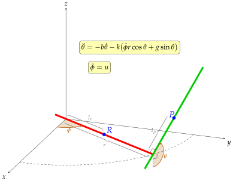
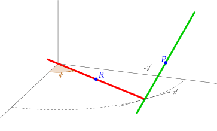

# Dynamics
## Linear CartPole

A cart with mass $m_c$ moves along the $x$-axis, so its center $C$ has coordinates $(x, 0)^T$.
A pole with mass $m_p$ is attached to the cart with a hinge at point $C$,
and rotates around with viscous friction.
The pole's center of mass is at $P$, moment of inertia is $I_p$.
The angle of rotation is denoted as $\theta$, measured counterclockwise from the axis $-y$.
A force $f_x$ is applied to the cart and the force of gravity $g$ acts on the pole.

  {width="75%"}

$$
\begin{align}
    & C = \begin{pmatrix}
        x \\ 0
    \end{pmatrix} 
    && \dot{C} = \begin{pmatrix}
        \dot{x} \\ 0
    \end{pmatrix} \\
    & P = \begin{pmatrix}
        x + l \sin \theta \\ - l \cos \theta
    \end{pmatrix}
    && \dot{P} = \begin{pmatrix}
        \dot{x} + l \dot{\theta} \cos \theta \\ l \dot{\theta} \sin \theta
    \end{pmatrix}
\end{align}
$$

The kinetic energy of the cart is

$$
\begin{align}
    T_c = \frac{1}{2} m_c \begin{Vmatrix}
        \dot{C}
    \end{Vmatrix}_2^2 = \frac{1}{2} m_c \dot{x}^2.
\end{align}
$$

As a result energy of the whole system is following

$$
\begin{align}
    T & = T_c + T_p = \frac{1}{2} \dot{x}^2 (m_c + m_p) + m_p \dot{x} l \dot{\theta} \cos \theta
            + \frac{1}{2} \dot{\theta}^2 \left( m_p l^2  + I_p \right); \\
    U & = \underbrace{U_c}_{0} + U_p = -m_p gl \cos \theta.
\end{align}
$$

To find the dynamics of system, let's use the Euler-Lagrange differential equation, where $L = T - U$, $q = (x, \theta)^T$ and $Q$ is the generalized force.
In our case, we have deal with two forces: motor force $f_x$ and viscous friction $f_{\theta}(\theta, \dot{\theta}) = -\mu \dot{\theta}$.

$$
\begin{align}
    Q &= \frac{d}{dt} \frac{dL}{d\dot{q}} - \frac{dL}{dq} = \begin{pmatrix} f_x \\ f_{\theta} \end{pmatrix}
\end{align}
$$

!!! abstract "Motion equations"
    $$
    \begin{align}
        m_p \ddot{x} l \cos \theta + \ddot{\theta} \left(m_p l^2 + I_p\right) + m_p g l \sin \theta &= f_{\theta}(\theta, \dot{\theta}) \\
        \ddot{x}(m_c + m_p) + m_p l \ddot{\theta} \cos \theta - m_p l \dot{\theta}^2 \sin \theta &= f_{x}.
    \end{align}
    $$

??? note "Derivation"
    $$
    \begin{equation}
        L = \frac{1}{2} \dot{x}^2 (m_c + m_p) + m_p \dot{x} l \dot{\theta} \cos \theta +
                \frac{1}{2} \dot{\theta}^2 \left( m_p l^2  + I_p \right) + m_p gl \cos \theta.
    \end{equation}
    $$

    $$
    \begin{align}
        \frac{dL}{d\theta} & = - m_p \dot{x} l \dot{\theta} \sin \theta - m_p gl \sin \theta \\
        \frac{dL}{d\dot{\theta}} & = m_p \dot{x} l \cos \theta + \left(m_p l^2 + I_p\right) \dot{\theta} \\
        \frac{d}{dt} \frac{dL}{d\dot{\theta}} & =
            m_p \ddot{x} l \cos \theta - m_p  \dot{x} l \dot{\theta} \sin \theta + \left(m_p l^2 + I_p\right) \ddot{\theta}  \\
        \frac{d}{dt} \frac{dL}{d\dot{\theta}} - \frac{dL}{d\theta} & =
                m_p \ddot{x} l \cos \theta + \left(m_p l^2 + I_p\right) \ddot{\theta} + m_p g l \sin \theta \\
    \end{align}
    $$

    $$
    \begin{align}
        \frac{dL}{dx} & = 0 \\
        \frac{dL}{d\dot{x}} & = (m_c + m_p) \dot{x} + m_p l \dot{\theta} \cos \theta \\
        \frac{d}{dt} \frac{dL}{d\dot{x}} & =
                (m_c + m_p) \ddot{x} + m_p l \ddot{\theta} \cos \theta - m_p l \dot{\theta}^2 \sin \theta \\
        \frac{d}{dt} \frac{dL}{d\dot{x}} - \frac{dL}{dx} & =
            (m_c + m_p) \ddot{x} + m_p l \ddot{\theta} \cos \theta - m_p l \dot{\theta}^2 \sin \theta. \\
    \end{align}
    $$

### Acceleration control

Let's make the assumption that the motor can generate any force necessary for the cart to reach acceleration in $[-a, a]$ on a fixed cart velocity range.
This fact allows us to consider the cart acceleration as a control input and significantly simplify the equations of motion

$$
\begin{align}
    \left(m_p l^2 + I_p\right) \ddot{\theta} &= f_{\theta}(\theta, \dot{\theta})
            - m_p \ddot{x} l \cos \theta - m_p g l \sin \theta \\
    \ddot{x}  &= u, \quad u \in [-a, a].
\end{align}
$$

But for practice it's more convenient to use another form

$$
\begin{align*}
    \left(m_p l^2 + I_p\right) \ddot{\theta} &= -\mu\dot{\theta} - m_p \ddot{x} l \cos \theta - m_p g l \sin \theta \\
    \ddot{\theta} &= -\frac{\mu}{\left(m_p l^2 + I_p\right)}\dot{\theta}
            - \frac{\ddot{x} \cos \theta - g \sin \theta}{l + \frac{I_p}{m_p l}}. \\
\end{align*}
$$

Since all parameters do not change over time, we can greatly simplify the motion equations.

!!! abstract "Motion equations"
    $$
    \begin{align}
        \ddot{\theta} &= -b\dot{\theta} - \frac{\ddot{x} \cos \theta - g \sin \theta}{k} \\
        \ddot{x} &= u, \quad u \in [-a, a].
    \end{align}
    $$

## Radial CartPole

Linear CartPole is classic kinematic scheme,
but it requires a lot of space, periodical homing (return cart to the initial pose ) and etc.
Radial CartPole is a modification, which allows to avoid problems, keeping the same motion equations.
In case of radial version cart moves along the circle with radius $r$.

  { width="75%"}

Pole's mass $m_p$, moment of inertian $I_p$ and distance from hinge to center of mass $l_p$ are known again.
But instead of position $x$ there is angle $\phi$ (in some sense $x = r\phi$) and control input is radial acceleration $\ddot{\phi}$.
Also, as shown in previous section, we can consider mass of cart is zero.

Actually, after some calculations we can get the same motion equations as for classic version,
but linear variables are replaced by angular ones

$$
\begin{align}
    \left(m_p l^2 + I_p\right) \ddot{\theta} &=
            f_{\theta}(\theta, \dot{\theta}) - m_p r \ddot{\phi} l \cos \theta - m_p g l \sin \theta \\
    \ddot{\phi}  &= u, \quad u \in [u_{min}, u_{max}].
\end{align}
$$

!!! abstract "Dynamics equation"
    $$
    \begin{align}
        \ddot{\theta} &= -b\dot{\theta} - \frac{r \ddot{\phi} \cos \theta - g \sin \theta}{k} \\
        \ddot{\phi} &= u, \quad u \in [u_{min}, u_{max}].
    \end{align}
    $$

??? note "Derivation"
    Note that $T_p^r = \frac{1}{2}I_p\dot{\theta}^2$ and $T_p^t = \frac{1}{2}m_p \begin{Vmatrix} \dot{P} \end{Vmatrix}_2^2$.
    To calculate $\begin{Vmatrix} \dot{P} \end{Vmatrix}_2^2$, consider the coordinates system plane,
    which is attached to the cart and tangent to the circle (pole fully lies in that plane).

    

      {width="50%"}
    

    $$
    \begin{align}
        \begin{Vmatrix} \dot{P} \end{Vmatrix}_2^2 = \left(\underbrace{\dot{\phi} r
            + \dot{\theta} l_p \cos \theta }_{\dot{x}'}\right)^2 
            + \left(\underbrace{\dot{\theta} l_p \sin \theta}_{\dot{y}'} \right)^2
            = \dot{\phi}^2 r^2 + 2 \dot{\phi} \dot{\theta} r l_p \cos \theta + \dot{\theta}^2 l_p^2.
    \end{align}
    $$

    Bellow rest of the calculations are shown

    $$
    \begin{align}
        T_p &= \frac{1}{2}I_p\dot{\theta}^2 + \frac{1}{2}m_p\left(\dot{\phi}^2 r^2
                + 2 \dot{\phi} \dot{\theta} r l_p \cos \theta + \dot{\theta}^2 l_p^2\right) \\
        U_p &= - m_p g l_p \cos \theta \\
        L = T_p - U_p &= \frac{1}{2} I_p \dot{\theta}^2 + \frac{1}{2} m_p \left(\dot{\phi}^2 r^2
                + 2 \dot{\phi} \dot{\theta} r l_p \cos \theta + \dot{\theta}^2 l_p^2\right) + m_p g l_p \cos \theta
    \end{align}
    $$

    $$
    \begin{align}
        \frac{dL}{d\theta} & = - m_p l_p (r \dot{\phi} \dot{\theta} \sin \theta + g \sin \theta) \\
        \frac{dL}{d\dot{\theta}} & = I_p \dot{\theta} + m_p l_p (\dot{\phi} r \cos \theta + l_p \dot{\theta}) \\
        \frac{d}{dt} \frac{dL}{d\dot{\theta}} & =
                I_p \ddot{\theta} + m_p l_p (r \ddot{\phi} \cos \theta + l_p \ddot{\theta} - r \dot{\phi} \dot{\theta} \sin \theta) \\
        \frac{d}{dt} \frac{dL}{d\dot{\theta}} - \frac{dL}{d\theta} & =
                \ddot{\theta} (I_p  + m_p l_p^2) + m_p l_p (r \ddot{\phi} \cos \theta + g \sin \theta) = 0.
    \end{align}
    $$

