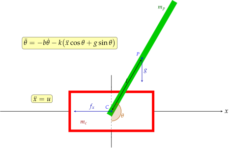

# MkDocs & mkdocs-material syntax test

See [mkdocs-material](https://squidfunk.github.io/mkdocs-material/reference/) for more examples

## Callouts

!!! note "Important note"
    This is a note

!!! warning
    Uh oh

## Buttons

[Open Foxglove](http://foxglove.robotics-lab.ru/){ .md-button target="_blank" }

## Code

``` py title="main.py"
import tensorflow as tf
```

## Math ([mathjax](https://docs.mathjax.org/en/latest/))

We can use inline $m * a * t * h$ as well as blocks:

$$\begin{align}
    T_p & = T^t_p + T^r_p \nonumber \\
        & = \frac{1}{2} m_p \begin{Vmatrix}\dot{P}\end{Vmatrix}_2^2 + \frac{1}{2}I_p\dot{\theta}^2 \nonumber \\
        & = \frac{1}{2} m_p (\dot{x} + l \dot{\theta} \cos \theta )^2 + \frac{1}{2} m_p (l \dot{\theta} \sin \theta)^2 + \frac{1}{2}I_p\dot{\theta}^2 \nonumber \\
        & = \frac{1}{2} m_p \dot{x}^2 + m_p \dot{x} l \dot{\theta} \cos \theta + \frac{1}{2} \dot{\theta}^2 \left( m_p l^2  + I_p \right).
\end{align}$$

## SVG ([tikzjax](https://github.com/kisonecat/tikzjax))

<script type="text/tikz">
\begin{tikzpicture}[>=stealth]
    % world
    \draw[->, thick] (-1,3.1) -- (15,3.1) node[right] {\Large $x$};
    \draw[-, thick] (7,0.5) -- (7,5.7);

    % hull
    \filldraw[red!100!black, fill=white, line width=5] (4.0,1.7) rectangle (10.0,4.5);

    % y axis help
    \draw[-, dashed] (7,1.2) -- (7,5.0);

    % stick
    \begin{scope}[rotate around={150:(7, 3.1)}]
        \filldraw[green!80!black, fill=green!80!black] (6.8, 3.4) rectangle (7.2, -6);

        % C
        \node[circle, fill=blue, opacity=0.6, scale=0.5, label={above left:{\textcolor{blue}{$C$}}}] at (7, 3.1) {};

        % P
        \node[circle, fill=blue, opacity=0.6, scale=0.5, label={above left:{\textcolor{blue}{$P$}}}] at (7, -1.3) {};

        % l
        \draw[<->, thick, black] (7,3) -- (7, -1.2) node[midway,above] {\large $l$};
    \end{scope}

    % f_x
    \draw[<-, thick, blue!70!black] (4.3,3.1) -- (6.9, 3.1) node[midway,above] {\large $f_x$};

    % g
    \draw[->, thick, blue!70!black] (9.2, 6.81) -- (9.2, 5.2) node[midway,right] {\large $g$};

    % \theta
    \draw[->, thick, orange!70!black] (7, 2.4) arc [start angle=-90, end angle=60, radius=0.7];
    \fill[->, opacity=0.2, orange!70!black] (7, 3.1) -- (7, 2.4) arc [start angle=-90, end angle=60, radius=0.7];
    \draw[thick, orange!70!black] (7.8, 2.8) node {\large $\theta$};

    % m_C
    \draw[red!60!black] (5, 2.3) node {\large $m_c$};

    % m_P
    \draw[green!40!black] (10.6, 10.5) node {\large $m_p$};

    % formula
    % \draw (4,8) node[fill=yellow!30, draw, rounded corners] {\Large $\ddot{\theta} = -b\dot{\theta} -\frac{\ddot{x} \cos \theta + g \sin \theta}{k}$};
    % \draw (2,4) node[fill=yellow!30, draw, rounded corners] {\Large $\ddot{x} = u$};
\end{tikzpicture}
</script>

## Images

<figure markdown>
  { width="600" }
  <figcaption>Image caption</figcaption>
</figure>

## Diagrams

``` mermaid
sequenceDiagram
  autonumber
  Alice->>John: Hello John, how are you?
  loop Healthcheck
      John->>John: Fight against hypochondria
  end
  Note right of John: Rational thoughts!
  John-->>Alice: Great!
  John->>Bob: How about you?
  Bob-->>John: Jolly good!
```
